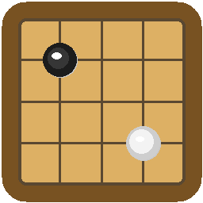

# Go Board Game

A fully playable 19×19 Go board game built in **Java** using the [Processing](https://processing.org) library. It enforces the Chinese ruleset, handles all the tricky game logic (ko, suicide, group capture via BFS liberty checking), and renders smooth 3D-style stones with real-time hover feedback.



https://github.com/user-attachments/assets/b50b9cbb-6e3c-4c03-96b8-1c9e5ed455c8

## Overview

This project implements the ancient strategy game of Go as a standalone desktop application. It enforces Chinese ruleset scoring, handles all edge-case game logic (ko, suicide, group capture), and renders smooth 3D-style stones with real-time hover feedback — built on top of Processing's Java2D rendering pipeline.

## Features

- **Chinese rules** — area scoring (stones + territory) with 7.5 komi for White
- **Capture detection** — BFS flood-fill liberty checking for individual stones and connected groups
- **Ko rule** — rejects moves that recreate the previous board position
- **Suicide prevention** — illegal self-capture moves are blocked before placement
- **Pass & Reset** — pass your turn or restart the game at any time
- **Game end** — two consecutive passes trigger automatic scoring and declare a winner
- **Territory visualisation** — empty intersections are marked at game end to show each player's scored regions
- **3D stone rendering** — each stone is drawn with shadow, radial gradient, and specular highlight layers
- **Hover preview** — semi-transparent ghost stone follows the cursor for precise placement
- **App icon** — custom logo displayed on the window, taskbar, and macOS Dock

## How It Works

The board state and rules live in a `Go` logic class, kept separate from the `Sketch` class that handles all Processing rendering and input. Captures are resolved with a **BFS flood-fill**: when a stone is placed, each adjacent enemy group is flooded to count its liberties, and any group with zero liberties is removed. The same liberty check, applied to the just-placed stone, enforces **suicide prevention**. The **ko rule** is implemented by snapshotting the previous board position and rejecting any move that would recreate it.

At game end (two consecutive passes), the engine performs **Chinese area scoring** — counting each player's stones plus the empty territory they fully enclose, adding a 7.5 komi for White, and declaring the winner. Stones are rendered as layered 2D primitives (drop shadow, radial gradient body, specular highlight) for a 3D look, and a translucent ghost stone tracks the cursor for precise placement.

## Skills Demonstrated

- Object-oriented design — game logic (`Go`) separated from rendering/input (`Sketch`)
- Game-rule engine — complete Go ruleset with Chinese area scoring and komi
- BFS flood-fill — stone and connected-group liberty/capture detection
- Graph connectivity — flooding adjacent groups to evaluate captures
- Ko-rule detection — rejects moves that repeat the previous board position
- Suicide-move prevention — illegal self-capture blocked before placement
- Territory scoring — enclosed-region detection for end-game area scoring
- Custom 2D rendering — layered 3D-style stones (shadow, radial gradient, specular highlight)
- Interactive UI — real-time hover ghost-stone preview
- Game state management — turn order, pass, reset, and automatic end detection
- Processing framework — `PApplet` with the Java2D renderer
- Application packaging — window/taskbar/Dock icon and a runnable JAR

## Tech Stack

- Java 17
- Processing (`PApplet`, Java2D renderer; `core.jar`)
- JOGL / GlueGen (bundled native libraries shipped with Processing for cross-platform support)
- Packaged as a runnable JAR (`Go.jar`)

## Demo & Links

- ⬇️ [Download the latest build](https://github.com/TheYellowDuck/go-board-game/releases)

## Getting Started

Requires Java 17 or later.

Download `Go.jar` from [Releases](https://github.com/TheYellowDuck/go-board-game/releases) and run:

```sh
java -jar Go.jar
```

### Building from source

```sh
javac --release 17 -cp "lib/core.jar:lib/gluegen-rt.jar:lib/jogl-all.jar" -d bin src/Go/Go.java src/Go/Sketch.java
```
